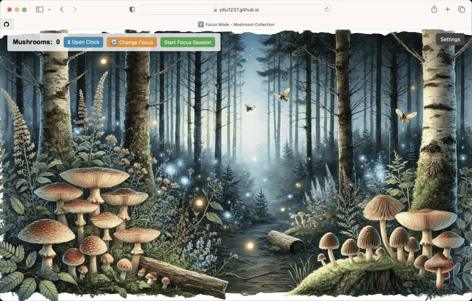
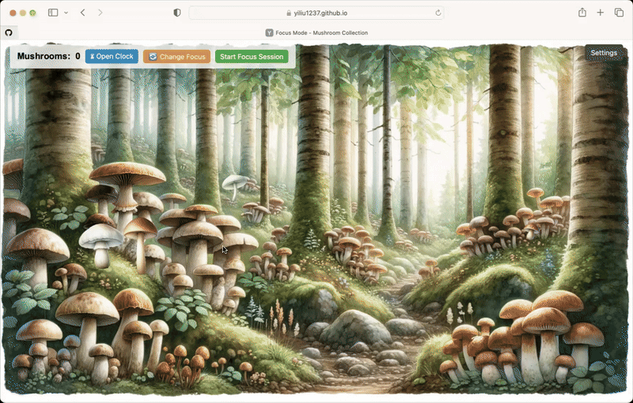

# FungiClock

**Fungi Clock** is a relaxing and playful productivity web app.  
Set focus sessions, collect adorable mushrooms, track real-time or custom time, and enjoy the company of a friendly cat companion!

This app combines a clock, focus timer, and mushroom collection system to encourage mindfulness and sustained attention in a cozy virtual forest.

---

## Features

- **Customizable Focus Timer:**  
  Choose a focus session between **10 minutes and 3 hours**.

- **Mushroom Collection System:**  
  Mushrooms appear dynamically during your focus time - click them to collect, or earn rewards automatically as you focus.

- **Dynamic Forest Scenes:**  
  Background changes throughout the day based on the current or manually set time:  
  _Morning, Noon, Afternoon, Evening, Night, and Dawn_.

- **Animated Cat Companion:**  
  A friendly cat cheers you on and changes poses during focus sessions.

- **Real-Time and Manual Clock:**  
  View a live clock or manually adjust the time for a different forest atmosphere.

- **Focus Session Summary:**  
  After completing a session, see a detailed summary of mushrooms collected.

- **Lightweight and Responsive:**  
  No frameworks or heavy dependencies - just fast, smooth, and responsive.

---

## Project Structure

---

## 🛠️ How It Works

### Focus Sessions
- Click **Start Focus Session** to begin.
- Set your desired focus duration (10–180 minutes).
- Mushrooms are collected passively based on focus time, and more mushrooms appear if you stay focused.
- You can stop early, but rewards scale with the time you remain focused.

### Mushroom Collection
- Mushrooms pop up on the background while you focus.
- Click on them to instantly collect, or let the session timer handle passive gathering.

### Scene and Time Dynamics
- The background image changes based on the time of day.
- Use the **Settings** panel to manually adjust the time and explore different scenes.
- A real-time clock overlay is available.

### End of Session
- After a session completes (or if you stop early), you'll see a **collection summary** listing how many mushrooms you gathered.

---

## Display

### Scene Transition

### Focus Mode

### Mushroom Collection

### Clock

---

## Built With

- HTML5
- CSS3
- Vanilla JavaScript

---

## Future Improvements

- Save mushroom collections between sessions
- Rare mushrooms based on focus duration
- Cat customization (choose different cat companions)
- Ambient soundscapes for each time period
- Achievements for consistent focus habits

---

## Quick Start

To run locally:

1. Clone this repository.
2. Open `index.html` directly in your browser.

No additional setup or backend required - it's fully frontend.

---

# Grow your forest, collect mushrooms, and master the art of focus! 
